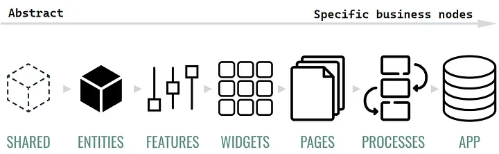
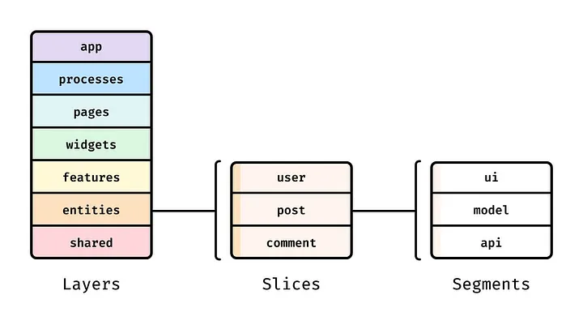
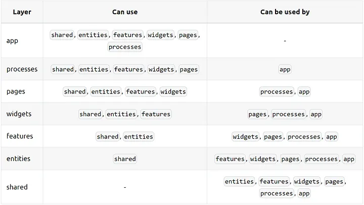

# Feature sliced

- [What is Feature Sliced Design (FSD)?](<#what-isfeature-sliced-design-(FSD)>)
- [When do we need use?](#when-do-we-need-use)
- [Get started](#get-started)

## What is Feature Sliced Design (FSD)?

**“Feature Sliced Design”** — architectural design methodology for Front-End applications, a design approach where a product’s features are divided into separate, standalone components, or “slices”. Each slice is then designed and developed independently, allowing for greater flexibility, modularity, and scalability in the design process. This approach is often used in software development and can be applied to the design of web or mobile applications, as well as other types of software products.

We figured out that idea behind FSD is to break down a complex product into smaller, more manageable pieces in each “Layer”. Each “Layer” might contain other manageable pieces — “Slices”. “Slaces” in turn may have “Segments”.

This can lead to faster development times, better team collaboration, and a more flexible and scalable final product.

Thus we have a set of puzzles that still need to be able to “assemble”. More details are below.

#### Assemble correctly from Childhood!

> FSD strives to be perfect. It was born with Mission — create a Сontrollable Unidirectional Encapsulated Flow (explicit one-way links).

I imagine a stream that turns into an ocean. A small stream knows nothing about the ocean, but the ocean knows about all the streams, rivers, lakes, and seas that feed it.

> Let’s say more — one river does not know about the existence of the other. This is the prerogative of the seas and oceans.

Technically, It means that the Bottom Layer (for example, shared) knows nothing about all the layers above or next to it. Upper layers (ex. entities) can use all the layers below, like a river that flows into the sea, not vice versa.

Let’s remember these Scope Rules. This is a small price for the flexibility and adaptivity that it gives.

## Structure example

- src/

  - app
    - app-router.tsx
    - app-store
  - processes/ `# (Optional) Application processes running over pages`
  - pages/ `# Application pages`

    - not-found
    - task-details

  - widgets/ `# (optional) Independent and self-contained blocks for pages`
  - features/ `# Processing of user scenarios`

    - tasks-filter
    - toggle-task

  - entities/ `# (Optional) Business entities that domain logic operates`
    - task
      - task-card
      - task-row
  - shared/ `# Reused modules, non-business specific`
    - api/ `# getTasksList api is here`
    - lib/ `# routerSelectors`
    - ui/ `# ui-kit modules`

> `app/`: Contains a setup of routing, store, and global styles.
> `processes/`: (Optional) Application processes running over pages
> `pages/`: Contains the route components for each page in the app, mostly composition, hardly any logic.
> `widgets/`: Contains the “assembled” post card, with content and interactive buttons that are wired up to the relevant calls on the back-end.
> `features/`: Always contains the interactivity of the card and the logic of processing those interactions.
> `entities/`: Сontains the skeleton of the card with slots for content and the interactive elements.
> `shared/`: Reusable functionality, detached from the specifics of the project/business.(e.g. UIKit, libs, API)
